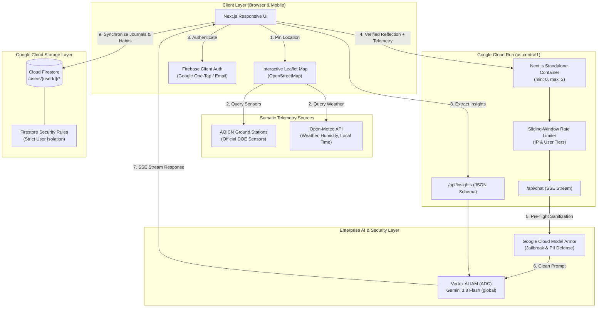

# 📖 Personal Gemini Journal: Somatic AI Sanctuary

[](#-live-production-deployment)
[](https://cloud.google.com/vertex-ai)
[](https://cloud.google.com/security/products/model-armor)
[](https://firebase.google.com/docs/firestore)
[](https://nextjs.org/)

> **A production-ready reflective journaling sanctuary deployed on Google Cloud Run for the Google Cloud Run AI Challenge / Ideathon 2026.**  
> Powered by **Gemini 3.8 Flash**, fortified with **Google Cloud Model Armor**, and grounded in **real-time somatic telemetry (AQICN ground stations + Open-Meteo)**.

---

## 🌟 Live Production Deployment

- 🚀 **Live Cloud Run URL**: `<REDACTED_CLOUD_RUN_URL>` *(Provided in official contest submission)*
- 🏷️ **Required Challenge Label**: `dev-tutorial=cloud-run-ai-challenge` (Verified ✅)
- 📍 **Cloud Run Region**: `us-central1` | **Vertex AI Location**: `global`
- 🛡️ **Model Armor Policy**: `personal-journal-sanctuary-guard` (Verified ✅)
- 🔑 **Least-Privilege Identity**: Dedicated user-managed Service Account (`personal-gemini-journal-sa`) (Verified ✅)

---

## 📑 Quick Navigation & Documentation

- [Executive Project Summary (`docs/PROJECT_SUMMARY.md`)](file:///d:/Projects/ideathon-ai-challenge/docs/PROJECT_SUMMARY.md) — Problem statement, feature matrix, and judge briefing.
- [Technical Architecture (`docs/ARCHITECTURE.md`)](file:///d:/Projects/ideathon-ai-challenge/docs/ARCHITECTURE.md) — Multi-region decoupled standard, Model Armor pipeline, and security matrix.
- [Context Engineering Case Study (`docs/CONTEXT_ENGINEERING.md`)](file:///d:/Projects/ideathon-ai-challenge/docs/CONTEXT_ENGINEERING.md) — The 4 primitives (Write/Select/Compress/Isolate) and 7-layer harness stack.

---

## 💡 The Core Innovation: Somatic & Environmental AI Grounding

Human psychology does not exist in an emotional vacuum. Late night hours, suffocating atmospheric humidity, and elevated particulate matter (PM2.5 / high AQI) directly trigger physical fatigue and brain fog. Standard chatbots offer generic advice that often exacerbates self-judgment.

**Personal Gemini Journal grounds reflective AI in the user's physical atmosphere**:
1. **Interactive OpenStreetMap Interface**: Users drag a pin or click to fine-tune their location on an anonymous, client-side Leaflet map with zero billing leak risk or tracking cookies.
2. **Official Government Sensors (AQICN / DOE)**: Pulls real-time ground-level air quality and dominant pollutant data (e.g. Malaysia Department of Environment) with automatic Open-Meteo fallback.
3. **Atmospheric Telemetry**: Captures live temperature (°C), relative humidity (%), and exact astronomical local time based on the pinned coordinates.
4. **Human-in-the-Loop Validation**: Presents the conditions in a rich telemetry card for one-click user confirmation before attaching to the reflection.
5. **Contextual Reflection**: Gemini 3.8 Flash weaves atmospheric reality into its guidance, helping users recognize when fatigue is a natural somatic response rather than personal failure.

---

## 🤖 Architectural Classification: Compound AI System & Agentic Workflow

Rather than a simple monolithic chatbot, Personal Gemini Journal is engineered as a **Compound AI System** featuring an **Agentic Workflow**:

- 🛠️ **Autonomous Tool Augmentation (Somatic Grounding)**: Unlike static text prompting, the system invokes external tool APIs (AQICN ground stations, Open-Meteo weather and astronomical time) to equip the LLM with empirical physical telemetry.
- 🎭 **Specialized Persona Agents**: Decomposes reflection into 5 distinct cognitive personas (Mindful Guide, Stoic Philosopher, Socratic Mentor, Creative Muse, Executive Strategist) that guide inquiry from different mental models.
- 📋 **Structured Action Planning**: An automated `/api/insights` engine uses Gemini JSON Schema to inspect unstructured reflections and autonomously synthesize structured tasks, priority categories, and micro-habits with streak momentum.
- 📡 **External Action Dispatching**: Extends beyond text by packaging and dispatching rich embeds directly to external productivity tools (Discord and Slack webhooks) with SSRF guardrails.
- 🛡️ **Pre-Flight Interception Guardrails**: Google Cloud Model Armor acts as an autonomous security boundary inspecting inputs for prompt injection and sensitive data before the core model is invoked.

---

## 🏛 System Architecture



---

## ✨ Features Overview

### 1. 🧠 Multi-Turn Reflective Personas
Switch seamlessly between 5 tailored conversational guides:
- **🧘 Mindful Guide**: Empathetic, grounded presence focused on self-compassion and breathing room.
- **🏛️ Stoic Philosopher**: Grounded in Marcus Aurelius and Epictetus; dichotomies of control.
- **🔍 Socratic Mentor**: Thoughtful inquiry using deep questions to unpack underlying assumptions.
- **🎨 Creative Muse**: Expansive, associative thinking for creative unblocking.
- **🎯 Executive Strategist**: Pragmatic, goal-oriented clarity and decision frameworks.

### 2. 🛡️ Google Cloud Model Armor Defense
- Pre-flight prompt inspection via `modelarmor.us-central1.rep.googleapis.com`.
- Intercepts adversarial jailbreaks (e.g. DAN prompts) and returns gentle mindful guidance before invoking the LLM.
- Sensitive Data Protection (SDP) basic inspection to safeguard personal identifiers.

### 3. 📊 Emotional Wellness Radar & Insights
- Evaluates reflections on a 0–100 scale across **Clarity, Energy, Stress, and Joy**.
- Visualizes emotional balance through an interactive SVG Wellness Radar.
- 7-day reflection streak heatmap to foster sustainable reflection habits.

### 4. 🎯 Action Items & Micro-Habits Tracker
- Gemini JSON Schema automatically identifies actionable next steps.
- Interactive checklist with completion status and streak tracking.
- Secure export integration to Discord and Slack with strict SSRF domain protection.

### 5. 📱 Universal Responsive UX
- **Desktop Collapsible Reflections Panel**: Collapse the sidebar with one click for a wide, distraction-free writing canvas.
- **Universal Token Indicator**: Real-time context tracking (`3.8 Flash • ~550t`) responsive across all mobile screens, landscape, and desktop.
- **Frictionless Demo Mode**: Immediate guest exploration with local storage persistence, plus Google Account one-tap cloud sync.

---

## 📁 Repository Structure

```
ideathon-ai-challenge/
├── docs/
│   ├── PROJECT_SUMMARY.md       # Executive contest summary for judges
│   ├── ARCHITECTURE.md          # Technical deep dive into decoupled multi-region & security
│   ├── CONTEXT_ENGINEERING.md   # Case study: Write/Select/Compress/Isolate & 7-layer stack
│   └── SUBMISSION_PITCH.md      # (Local) Pitch kit, social media & video script
├── src/
│   ├── app/
│   │   ├── api/
│   │   │   ├── chat/route.ts    # Multi-turn SSE stream with Model Armor & Rate Limiter
│   │   │   ├── insights/route.ts# Structured JSON mood & habit extractor
│   │   │   └── export/webhook/route.ts # Webhook dispatcher with SSRF protection
│   │   ├── layout.tsx           # Root layout with responsive dark/light themes
│   │   ├── page.tsx             # Main hub connecting Chat, Analytics, and Habits
│   │   └── globals.css          # Glassmorphism utilities and responsive theme
│   ├── components/
│   │   ├── EnvironmentModal.tsx # Interactive Leaflet map & live telemetry cards
│   │   ├── LocationBadge.tsx    # Atmospheric grounding pill in input toolbar
│   │   ├── JournalChat.tsx      # Chat interface with streaming markdown & token meter
│   │   ├── JournalSidebar.tsx   # History list with desktop collapse toggle
│   │   ├── AnalyticsDashboard.tsx # Emotional wellness radar & streak heatmap
│   │   ├── HabitsTracker.tsx    # Micro-habits checklist & webhook export
│   │   ├── VoiceRecorder.tsx    # Speech-to-text dictation with pulsing waveform
│   │   └── PersonaSelector.tsx  # Modal selector for reflective guides
│   ├── lib/
│   │   ├── gemini/
│   │   │   ├── client.ts        # Vertex AI IAM client (baseUrl injected)
│   │   │   └── modelArmor.ts    # Google Cloud Model Armor integration
│   │   ├── weather/
│   │   │   └── telemetry.ts     # AQICN ground station + Open-Meteo hybrid engine
│   │   ├── security/
│   │   │   └── rateLimit.ts     # Sliding-window in-memory rate limiter
│   │   ├── firebase/
│   │   │   ├── client.ts        # Firebase Auth & Firestore client
│   │   │   └── firestore.ts     # Type-safe user-isolated Firestore CRUD
│   │   └── types/journal.ts     # TypeScript interfaces for journals & telemetry
├── scripts/
│   ├── test-full-workflow.js    # Automated end-to-end verification test suite
│   ├── test-model-armor.js      # Model Armor live verification test
│   ├── test-telemetry.js        # AQICN & Open-Meteo verification script
│   └── test-gemini-endpoint.js  # 1-token reachability ping for Model Stability Protocol
├── firestore.rules              # Strict user-isolated Firestore rules
├── Dockerfile                   # Next.js multi-stage standalone container
├── deploy.ps1 / deploy.sh       # One-click Cloud Run deployment with required labels
└── tsconfig.json                # Explicitly scoped TypeScript configuration
```

---

## 🛠️ Step-by-Step Local Setup

### 1. Clone & Install Dependencies
```bash
git clone https://github.com/nashy3k/personal-gemini-journal.git
cd personal-gemini-journal
npm install
```

### 2. Configure Environment Variables
Copy the template file:
```bash
cp .env.example .env.local
```
Fill in your configuration:
```env
# Google Cloud
GOOGLE_CLOUD_PROJECT=your-gcp-project-id
GEMINI_MODEL=gemini-3.8-flash
VERTEX_AI_LOCATION=global
USE_VERTEX_AI=true

# Google Cloud Model Armor
ENABLE_MODEL_ARMOR=true
MODEL_ARMOR_LOCATION=us-central1
MODEL_ARMOR_TEMPLATE=personal-journal-sanctuary-guard

# Atmospheric Telemetry
NEXT_PUBLIC_AQICN_TOKEN=your_aqicn_token_here

# Firebase Web Config
NEXT_PUBLIC_FIREBASE_API_KEY=your_api_key
NEXT_PUBLIC_FIREBASE_AUTH_DOMAIN=your_project.firebaseapp.com
NEXT_PUBLIC_FIREBASE_PROJECT_ID=your_project
NEXT_PUBLIC_FIREBASE_DATABASE_ID=gemini-journal
```

### 3. Run Development Server
```bash
npm run dev
```
Open [http://localhost:3000](http://localhost:3000) in your browser.

---

## 🧪 Automated Verification & Diagnostics

To execute the automated end-to-end verification suite:

```bash
# Verify live telemetry (AQICN + Open-Meteo)
node scripts/test-telemetry.js

# Verify Google Cloud Model Armor
node scripts/test-model-armor.js

# Verify full 8-step user journey against Cloud Run
node scripts/test-full-workflow.js
```

---

## 🔒 Firebase Authentication & Firestore Security Rules (Multi-Tenancy)

Multi-tenancy and cryptographic privacy are enforced at the database layer via **Cloud Firestore Security Rules** (`firestore.rules`). Each authenticated user is strictly confined to their own document subtree (`/users/{userId}/*`):

### Firestore Security Rules (`firestore.rules`)
```javascript
rules_version = '2';
service cloud.firestore {
  match /databases/{database}/documents {
    // Multi-tenant user isolation: users can only read/write their own reflections & habits
    match /users/{userId}/{document=**} {
      allow read, write: if request.auth != null && request.auth.uid == userId;
    }
  }
}
```

### Multi-Tenant Architecture & Data Flow:
1. **Client Identity**: The user authenticates via Firebase Authentication (Google One-Tap or Email/Password), acquiring a signed JWT ID token.
2. **Path Isolation**: All Firestore operations strictly target `/users/${user.uid}/journals/${journalId}` and `/users/${user.uid}/habits/${habitId}`.
3. **Database Enforcement**: If a user attempts to read, write, or query reflections outside their matching `request.auth.uid`, Firestore cryptographically rejects the operation at the infrastructure level with `PERMISSION_DENIED`.

### 🛡️ Tiered Access & Rate Limiting (Guest Sandbox vs. Authenticated Multi-Tenancy)

To provide an instant, zero-friction evaluation experience for hackathon reviewers while strictly preventing denial-of-wallet abuse and runaway billing, the application implements a dual-tier security model enforced via backend sliding-window rate limiters (`src/lib/security/rateLimit.ts`):

| Tier | Storage Boundary | Rate Limit & Quota | Purpose & Architectural Behavior |
| :--- | :--- | :--- | :--- |
| **Guest Demo (Sandbox)** | Local client sandbox (`demo-user`) in browser storage | **5 reflections per 10 minutes** (IP-keyed) | Zero-friction evaluator walkthrough without requiring Google sign-in credentials upfront. Safe transient demo environment. |
| **Authenticated (Google / Email)** | Isolated Cloud Firestore subtree (`/users/{userId}/*`) | **30 reflections per minute** (UID-keyed) | Persistent encrypted multi-tenant storage, habit tracking, analytics streak momentum, and webhook export. |

- **Security & Abuse Defense**: Unauthenticated calls exceeding 5 turns in 10 minutes are rejected with HTTP 429 (`guestChatLimiter`), encouraging the user to sign in for full multi-turn capabilities.
- **Data Boundary**: Guest data never touches cloud databases, and database-level `firestore.rules` prevent unauthenticated access to any user data.
- **Compute Concurrency Cap**: Paired with Cloud Run's `max-instances: 2` ceiling, the system prevents adversarial instance flooding.

### Deploying Firestore Security Rules
Deploy the rules directly using the Firebase CLI:
```bash
firebase deploy --only firestore:rules
```

---

## 🚀 Cloud Run Deployment

Deploy directly to Google Cloud Run using the deployment scripts:

**Linux / macOS:**
```bash
chmod +x deploy.sh
./deploy.sh
```

**Windows PowerShell:**
```powershell
.\deploy.ps1
```

Both deployment scripts enforce:
- Target Compute Region: `us-central1`
- Cloud Run Scaling: `min-instances: 0`, `max-instances: 2`
- Mandatory Challenge Label: `--labels "dev-tutorial=cloud-run-ai-challenge"`

---

## 📜 License

This project is licensed under the **Polyform Noncommercial License 1.0.0**.

- **Non-commercial Use Only**: You are free to view, fork, and use this code for personal, educational, or testing purposes.
- **Commercial Use Restricted**: Commercial use, including running this bot as a paid service or using the logic in commercial products, is strictly prohibited without explicit permission from the author.

See the [LICENSE](https://github.com/nashy3k/personal-gemini-journal/blob/main/LICENSE) file for the full legal text.

Copyright (c) 2026 nashy3k
